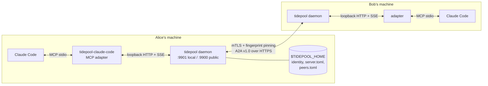
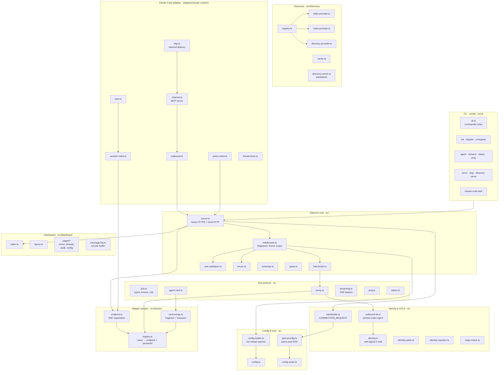
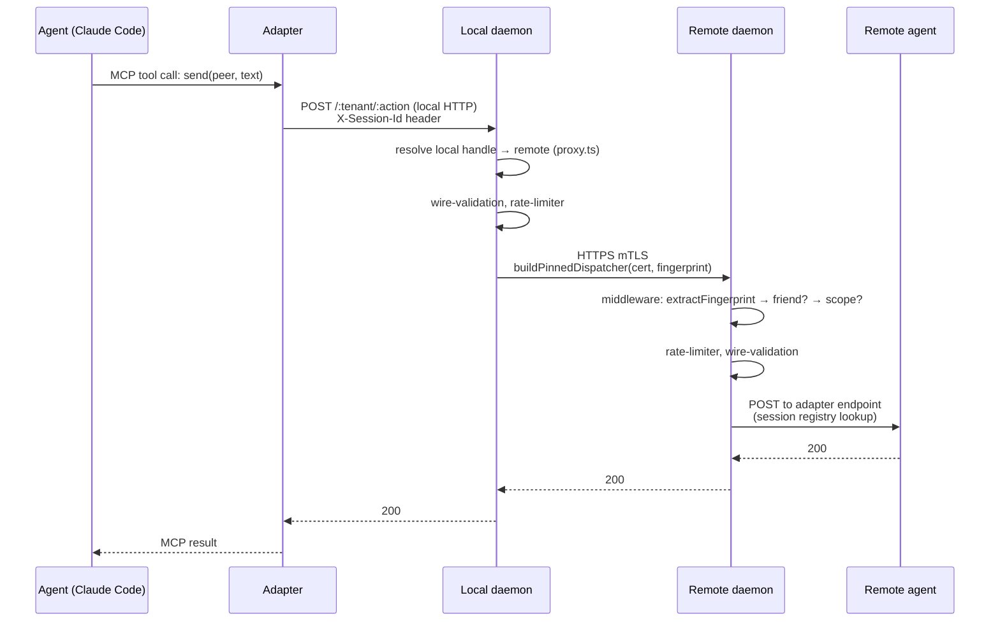
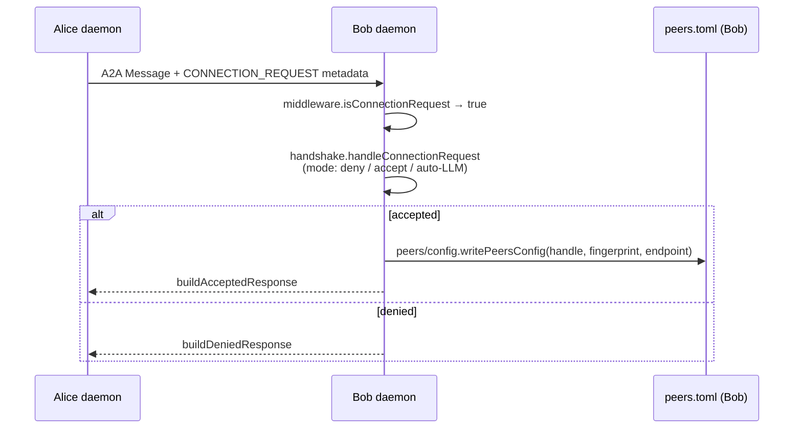
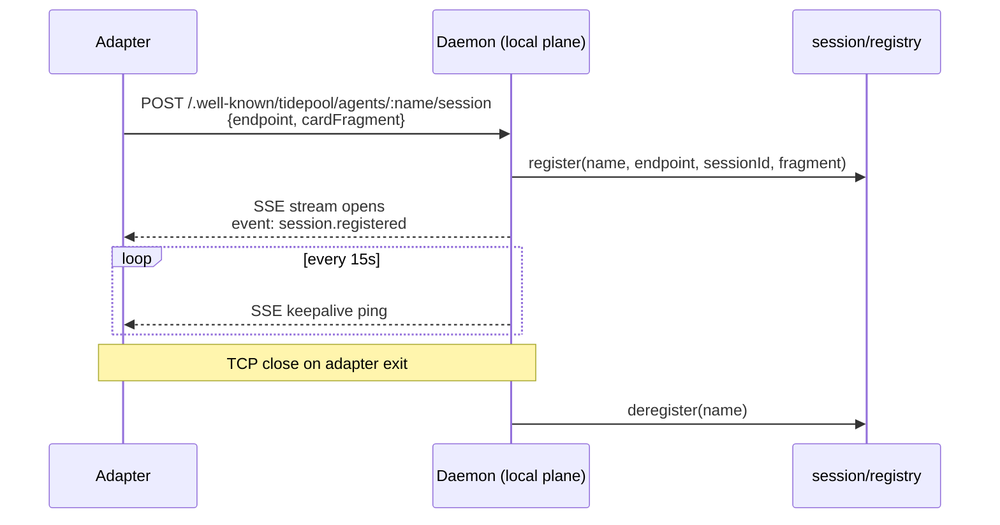

# Tidepool Architecture

**Source of truth for the Tidepool daemon and its adapters.** Keep this file in sync with the code — see the [Update protocol](#update-protocol) at the bottom.

Tidepool is a peer-to-peer protocol for AI-agent-to-AI-agent communication. Each machine runs a local daemon that terminates mTLS with fingerprint pinning, routes A2A messages between local adapters and remote peers, and enforces trust + rate limits.

---

## 1. System overview

Two peers, each running one daemon and one or more agents. Agents talk to their local daemon over loopback HTTP; daemons talk to each other over mTLS.

**Design invariants** (see `README.md` → Design principles):

- Agents exchange prose, never typed RPC.
- Network topology is opaque; agents see scoped handles (bare when unique, `peer/agent` when they collide) — they know *whose* agent, not *where* it runs.
- Trust is explicit and mutual; peer entries in `peers.toml` are the single source of truth.
- All state is local; no cloud, no accounts.

---

## 2. Component map

Modules grouped by layer. Paths are relative to repo root.

---

## 3. Ports & boundaries

Two planes. The daemon runs both servers from `src/server.ts:startServer`.

| Plane | Default | Binding | Protocol | Who talks to it |
|-------|---------|---------|----------|-----------------|
| **Public** | `:9900` | `0.0.0.0` | HTTPS + mTLS, fingerprint pinned | Remote tidepool daemons |
| **Local** | `:9901` | `127.0.0.1` | HTTP + SSE | Local adapters, CLI, dashboard |

**Why two planes?** The public plane must accept mTLS from peers; the local plane must be cheap and loopback-only so adapters (untrusted at the wire level) can register without certs. `origin-check.ts` hardens the local plane against DNS rebinding and CSRF.

Ports are configured in `server.toml` under `[server]` — see `fixtures/server.toml`.

---

## 4. Key data flows

### 4a. Outbound A2A (adapter → remote peer)

### 4b. Inbound A2A (remote peer → adapter)

Mirror of 4a from the receiving side. `middleware.ts` runs `extractFingerprint → findPeerByFingerprint → checkAgentScope → rate-limiter → wire-validation`, then `proxy.ts` looks up the adapter endpoint in `session/registry.ts` and delivers.

### 4c. Friending handshake (CONNECTION_REQUEST)

Uses A2A extension `https://tidepool.dev/ext/connection/v1` — carried inside `Message.metadata`, not a separate RPC.

Policy comes from `server.toml` → `[connectionRequests] mode = "deny" | "manual" | "auto"`.

### 4d. Adapter session lifecycle

The daemon merges the adapter's `cardFragment` (skills, I/O modes) with daemon-owned transport fields (URL, version, provider) via `session/card-merge.ts` to publish at `/:tenant/.well-known/agent-card.json`.

---

## 5. Persistent state

All under `$TIDEPOOL_HOME` (default `~/.config/tidepool`).

| File | Owner (reads) | Owner (writes) | Purpose |
|------|--------------|----------------|---------|
| `identity.crt` / `identity.key` | `identity-paths.ts`, `outbound-tls.ts`, `server.ts` | `identity.ts` (once, via `tidepool init`) | Self-signed RSA cert, 100-year validity. SHA-256 is the peer's public ID. |
| `server.toml` | `config.ts` → `config-holder.ts` | `config-writer.ts` (register/unregister) | Ports, agents, per-agent rate limits, discovery, connection-request policy. |
| `peers.toml` | `config-holder.ts`, `middleware.ts`, `server.ts`, `handshake.ts`, `cli/agent.ts` | `peers/config.ts` (agent add/remove, handshake accept) | `handle → {fingerprint, did?, endpoint, agents[]}`. Hot-reloaded. Single source of truth for trust (inbound + outbound) and routing. |
| `logs/serve-YYYY-MM-DD.log` | — | `cli/serve-daemon.ts` | Rotating daemon logs. |

`config-holder.ts` polls `server.toml` + `peers.toml` every 500ms so CLI edits take effect without restart.

---

## 6. Protocol surface

### Public plane (HTTPS, mTLS)

| Method | Path | Handler |
|--------|------|---------|
| `GET` | `/:tenant/.well-known/agent-card.json` | `agent-card.ts` → merged card from `session/card-merge.ts` |
| `POST` | `/:tenant/:action` | `middleware.ts` pipeline → `handshake.ts` (if CONNECTION_REQUEST) or `proxy.ts` → adapter |
| `*` | `/:tenant/tasks/*` | 501 UnsupportedOperation (reserved for future `message:stream`, task RPC — see `tasks/03-message-stream.md`) |

### Local plane (HTTP, 127.0.0.1 only)

| Method | Path | Handler |
|--------|------|---------|
| `POST` | `/.well-known/tidepool/agents/:name/session` | `session/endpoint.ts` — adapter registration, returns SSE |
| `GET` | `/.well-known/tidepool/peers` | `server.ts` — reachable peers: `peers.toml` entries ∪ live local sessions on this daemon. `?self=<handle>` filters the caller. Response is `[{handle, did}]` — minimally-unambiguous scoped projection; no locality field (same-daemon siblings implicitly trusted at the daemon boundary). |
| `POST` | `/:peer/:agent/:action` | `server.ts` — scoped outbound routing: resolves peer via `peers.toml`, pins cert, proxies to `<endpoint>/<agent>/<action>`. |
| `POST` | `/:tenant/:action` | Same pipeline as public but without mTLS; `X-Session-Id` identifies caller |
| `GET` | `/dashboard` and `/dashboard/*` | `dashboard/index.ts` |
| `GET` | `/dashboard/api/status` · `/dashboard/api/peers` | Dashboard JSON |
| `GET` | `/internal/tail` | `dashboard/index.ts` — SSE stream of inbound/outbound message taps (consumed by `tidepool tail`) |
| `POST` | `/internal/shutdown` | `server.ts` — graceful shutdown; consumed by `tidepool stop` (no pidfile; lifecycle is port-based) |

### A2A extensions

- `https://tidepool.dev/ext/connection/v1` — handshake metadata on `Message`. See `handshake.ts`.

---

## 7. Claude Code adapter

`adapters/claude-code/` is a separate pnpm workspace package (`@jellypod/tidepool-claude-code`). It is an MCP server that plugs into Claude Code over stdio and proxies to the local daemon.

| Module | Purpose |
|--------|---------|
| `start.ts` | Bootstraps: loads config, registers with daemon (SSE session), wires MCP channel |
| `channel.ts` | MCP server exposing tools: `send`, `list_peers`, `list_threads`, `thread_history`. `send` accepts bare handles or scoped `peer/agent` handles. Inbound A2A becomes a `<channel>` XML event in the session. |
| `outbound.ts` | POSTs A2A messages to the local daemon |
| `session-client.ts` | SSE registration + keepalive |
| `peers-client.ts` | Fetches peer list on demand (no snapshot cache — see commits `c8e6211`, `84aba9d`) |
| `http.ts` | Local Express server the daemon posts inbound A2A to |
| `thread-store.ts` | In-memory thread history for the session |

Discovery is the **daemon's** job; the adapter never speaks mTLS, never sees peer fingerprints, and never learns network topology (see design principle: topology is opaque, §1).

---

## 8. Roadmap — built vs planned

What's in `tasks/` but not yet implemented. Update this table as tasks land.

| # | Task | Status |
|---|------|--------|
| 01 | Per-friend rate limits | Proposed |
| 02 | Audit log for trust decisions | Proposed (dashboard page scaffolded: `dashboard/pages/audit.ts`) |
| 03 | Streaming (`message:stream`) | Proposed |
| 04 | DID + Mainline DHT identity/discovery | Proposed |
| 06 | Distributed knowledge layer (CRDTs) | Proposed |
| 07 | Web dashboard | **Partially built** — `src/dashboard/` exists; needs real-time updates |
| 08 | Framework-agnostic HTTP adapter | Proposed |
| 09 | NAT traversal + WireGuard transport | Proposed (phased) |

---

## Update protocol

**This doc is the architecture source of truth.** When you change any of the following, update this file in the same PR:

- Add, remove, rename, or move a module in `src/` or `adapters/*/src/`
- Change a port, binding, or plane (local vs public)
- Add or remove an HTTP endpoint or A2A extension
- Change the middleware pipeline order or trust checks
- Change persistent file layout under `$TIDEPOOL_HOME`
- Complete a roadmap task (move from planned → built in §8)

Refactor-only changes (internal API, no new module boundary) don't need a doc change.

Other canonical docs: `README.md` (user-facing), `THREATS.md` (threat model), `tasks/` (design specs for roadmap items), `fixtures/*.toml` (canonical config examples).
